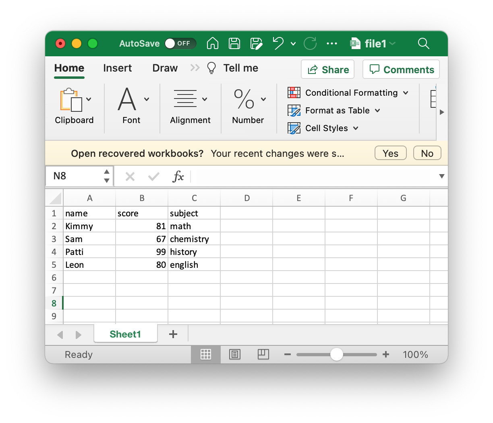
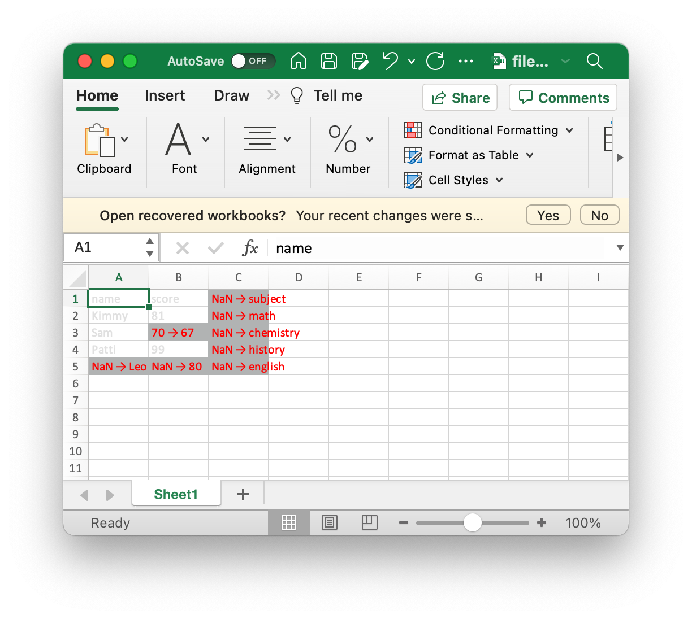

# How to use

1. Install Python 3 in your machine
2. use `python3 compare_excel.py` to run the script
3. Follow the prompts and enter the paths to the two excel files

# How it works

The script will compare two excel files and highlight the changed cells in these files.

For example, the original two excel files:

 

The result file:

